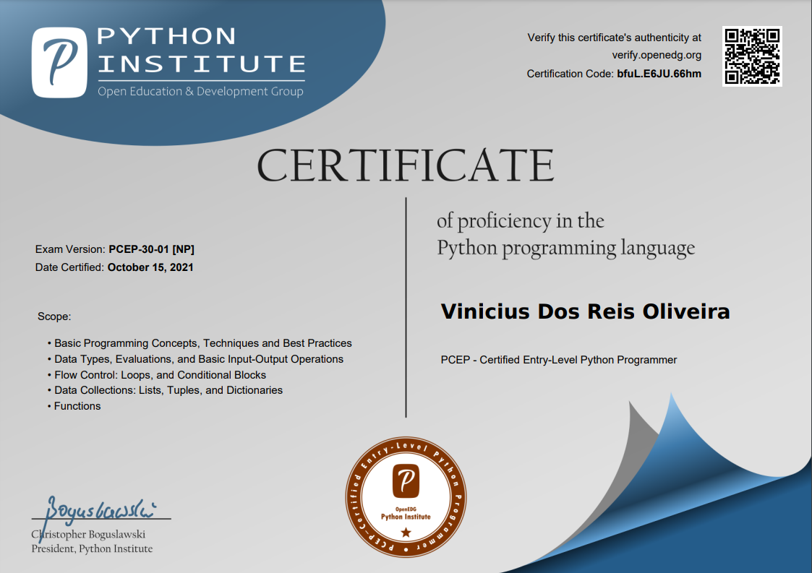
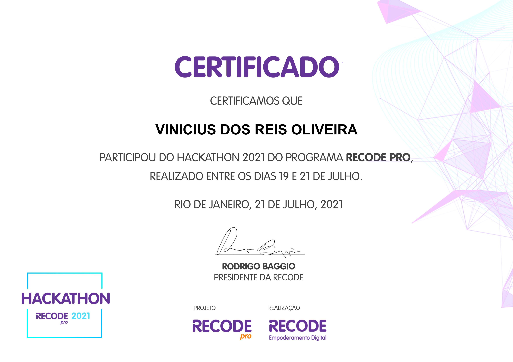
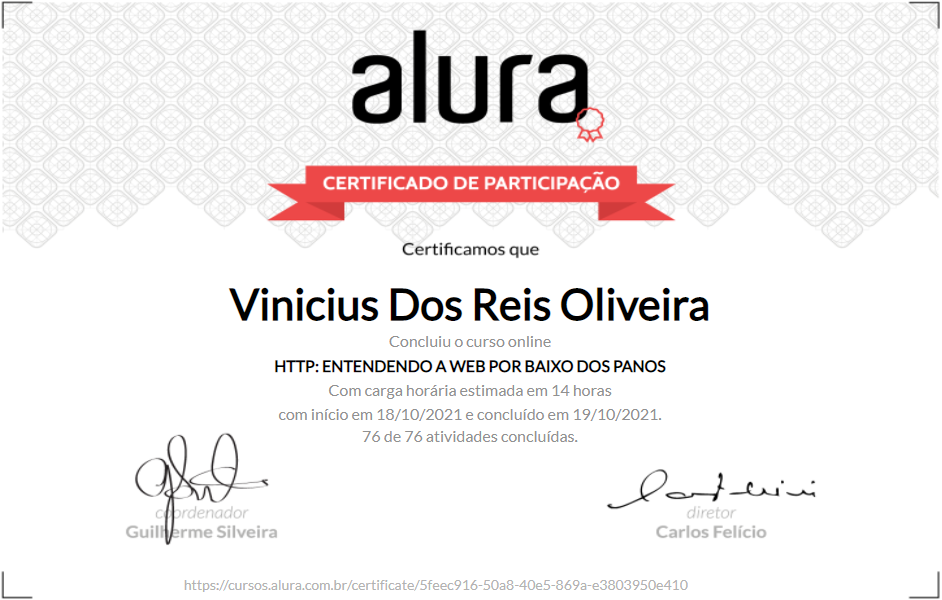
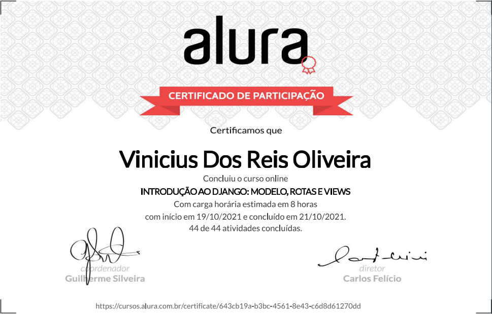
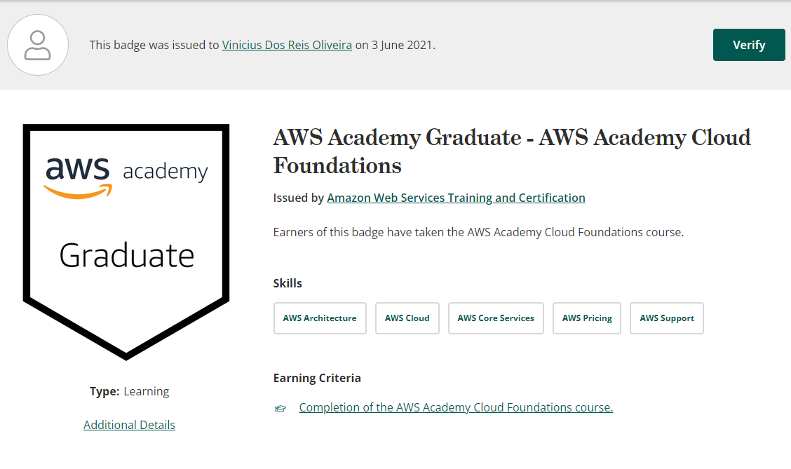
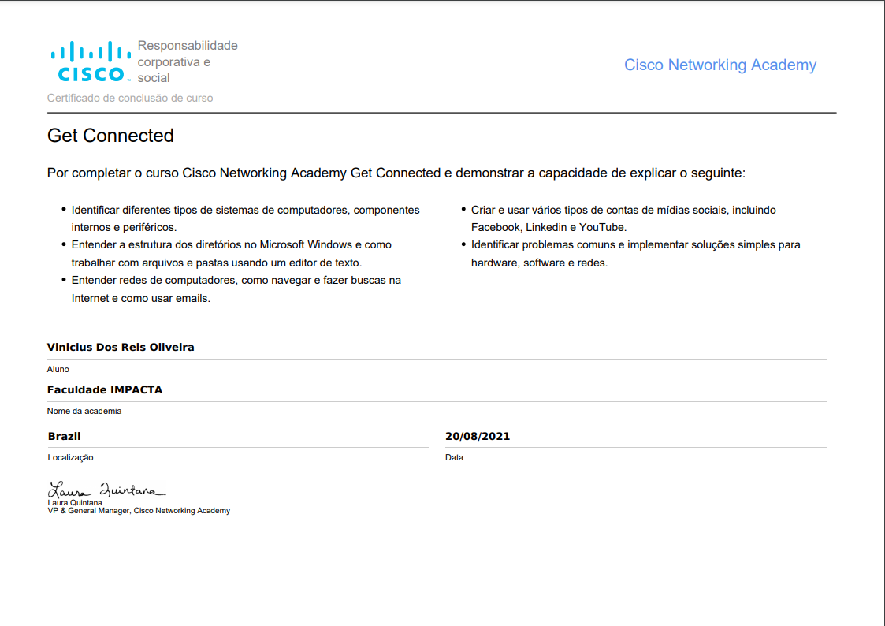
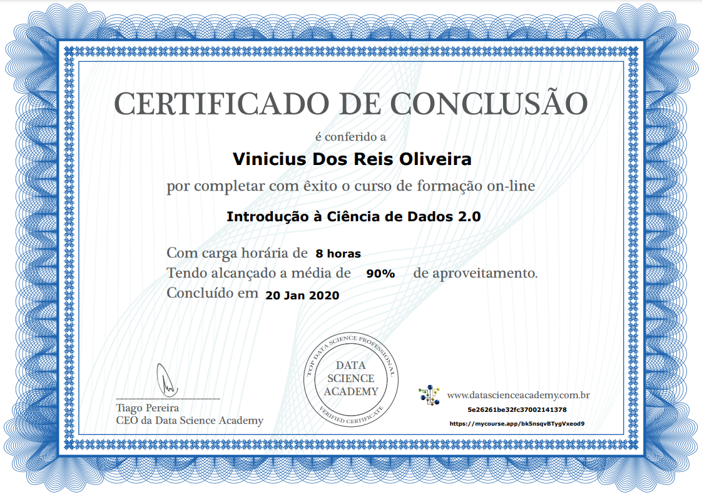
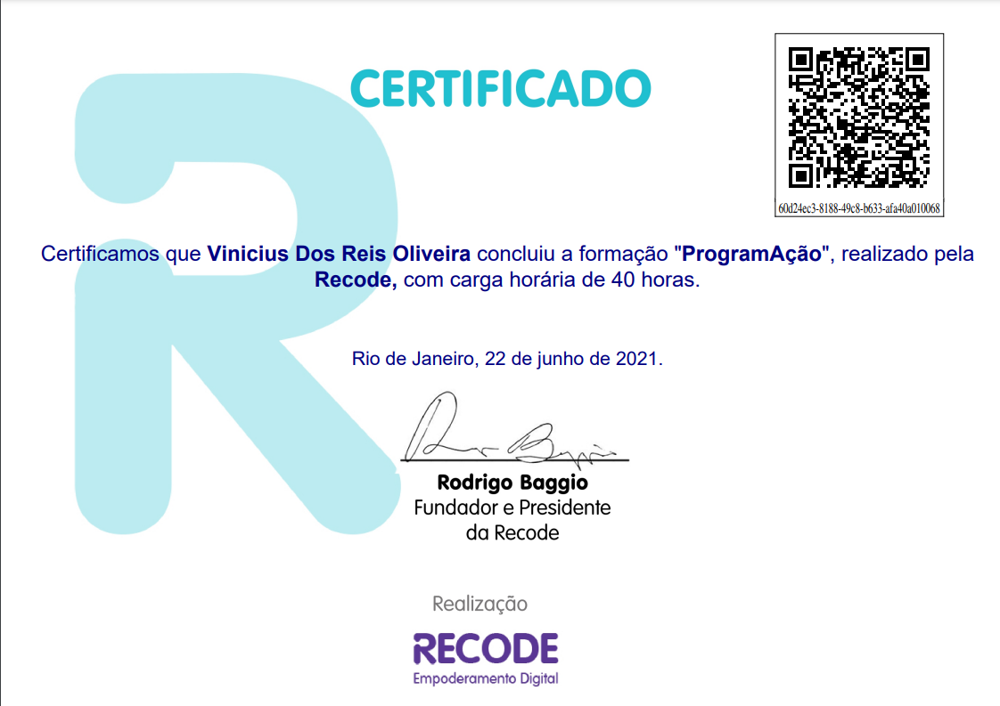
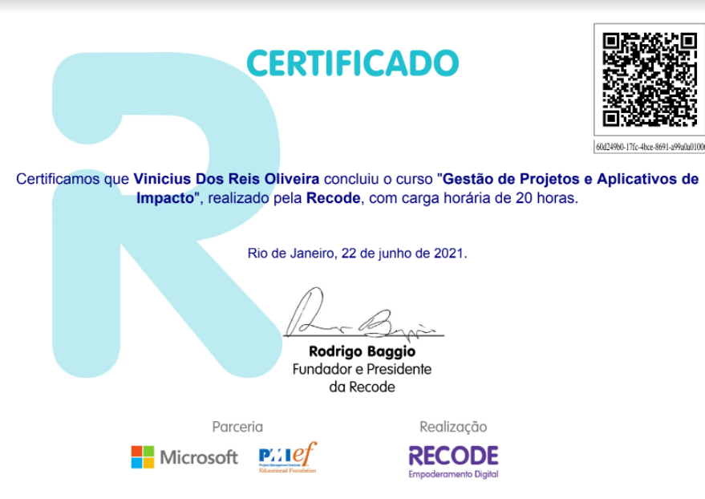
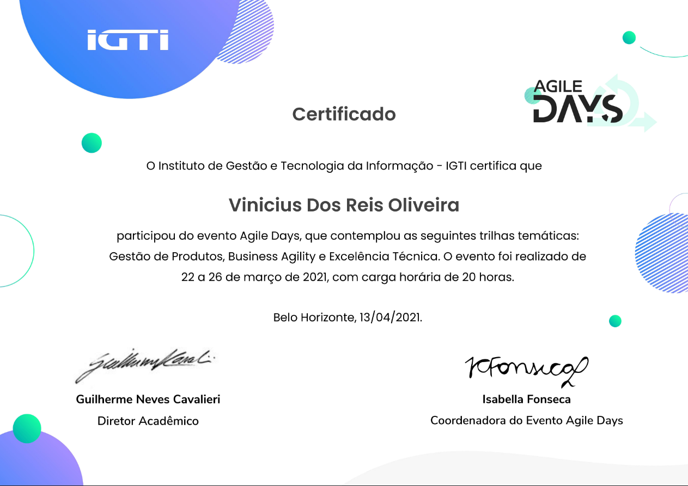

<header>
 <h2 align="center">Hi there 
  i’m Vinicius Reis :smile:</h2>
</header>

<section>
 <h3 align="center">  📫 How to reach me:</h3>
  
  

   <a href="https://www.linkedin.com/in/viniciusdosreis" target="_blank">
    &nbsp;&nbsp;&nbsp;&nbsp;&nbsp;&nbsp;&nbsp;&nbsp;
 </a>
<!--  <a href="https://www.instagram.com/vinnireis" target="_blank"> &nbsp;&nbsp;&nbsp;&nbsp;&nbsp;&nbsp;&nbsp;&nbsp;</a>  -->
&nbsp;&nbsp;&nbsp;&nbsp;&nbsp;&nbsp;&nbsp;&nbsp;

  
  
 
</section>
  

<!-- About ME -->
<section>
 <h3 align="center">About me 👀</h3>
 <ul>  
  <li> :man_technologist: Graduated in Systems Analysis and Development from the Faculdade Impacta de Tecnologia</li>
  <li> :blue_heart: I love this beautiful language that is Python</li>
  <li> :handshake: I currently working as a back-end developer at LigaInvest/Picpay.</li>
 </ul>
<!--- - 💞️ I’m looking to collaborate on a new job opportunity, being able to acquire new knowledge and professional growth in the programming area --->
</section>
 

  
 <!-- Skills -->
<section>
 

    <h3 align="center">:computer: Core skills</h3>
    <!-- FRONT-END -->
    <table>
     <tbody>
      <tr>
       <th>Python</th>
       <th>Flask</th>
       <th>FastAPI</th>
       <th>MongoDB</th>
       <th>MySQL</th>
       <th>Redis</th>
       <th>Docker</th>
       <th>Git</th>
      </tr>
      <tr>
       <td>
       </td>
       <td>
        
       </td>
       <td>
        
       </td>
       <td>
       </td>
       <td>
        
       </td> 
       <td>
    </td>
       <td>
        
       </td>   
       <td>
        
       </td>
      </tr>
     </tbody>
    </table>
 

</section>

 <!-- FRONT-END  style="text-align: center" align="center"-->
 <!-- Skills -->
<section>
 

  <h3>:computer: Other skills</h3>
  <table>
   <tbody>
    <tr>
     <th>HTML5</th>
     <th>CSS3</th>
     <th>Django</th>
     <th>Java</th>
     <th>PostgreSQL</th>
    </tr>
    <tr>
     <td>
     </td>
     <td>
     </td>
     <td>
      
     </td>
     <td></td>
     </td>
     <td>
      
     </td>
    </tr>
   </tbody>
  </table>
 

</section>

<!---
vnnstar/vnnstar is a ✨ special ✨ repository because its `README.md` (this file) appears on your GitHub profile.
You can click the Preview link to take a look at your changes.
--->

 <section>
  

  <h3 align="center"> 📊GitHub Stats</h3>
  

  
 
 

  
 
 </section>
  

  
 <section>
  <h2 align="center">📃 Certifications</h2>
 <!-- Python certificated -->
 

  
Python Institute

    
  

      
  

 

   
   
   
  <h2 align="center">📃 Hackathon</h2>
<!-- RECODEPRO -->
  
  
  
RecodePro

     
   
   
 

 
  <!-- Courses certifications -->
<h2 align="center">📃 Courses</h2>
 
 <!-- Alura -->
 

 
Alura

  

   <h5>HTTP</h5>
    
   
   <h5>Django Fundamentos</h5>
    
  

 

 
 <!-- AWS -->
 

  
AWS

  

   <h5>AWS Academy Cloud Foundations</h5>
      
  

 

 
  <!-- Cisco Academy -->
 

  
Cisco Academy

  

   <h5>Get connected</h5>
      
  

 

 
 <!-- Curso em video -->
 

  
Curso em vídeo

  

   
  <!-- Python -->
   <h5>Python</h5>
   
   
  

 

 
  <!-- Data Science Academy -->
 

  
Data Science Academy

  

   <h5>Introdução à Ciência de Dados 2.0</h5>
      
  

 

 
 
 <!-- RecodePro -->
 

 
RecodePro

  

   
  <!-- Cursos Recode -->
   <h5>Lógica de programação e algoritmos</h5>
   
   <h5>Gestão de Projetos</h5>
   
  

 

 
 <!-- Event participation certificates-->
 <h2 align="center">📃Event participations </h2> 
 

  <!-- IGTI EVENTOS -->
  
IGTI

  

   <h5>Cloud & Cyber Experience</h5>
   
   <h5>Agile Days</h5>
   
  

 

   
   
  

 <section>
  <table align="center">
  <th>Total profile visits :detective:</th>
   <tr>
    <td></td>
  </table>
 </section>
 

